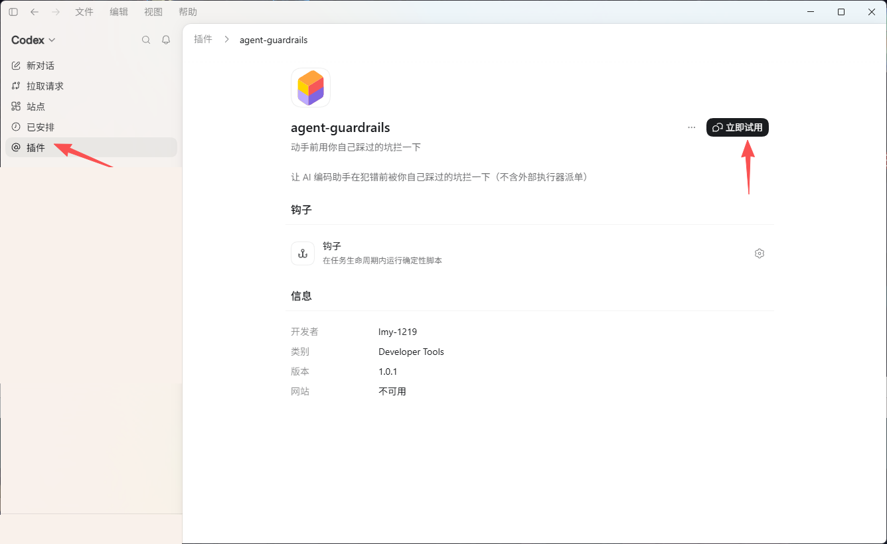

# agent-guardrails

让 AI 编码助手在动手之前，被你自己踩过的坑拦一下。

5 个挂点，9 条示范规矩，3 个版本（Claude Code、Claude Code＋派单、codex）。规矩是数据（一条一个 yaml），引擎是通用的；模型不能自己让一条规矩生效，必须你点头。

> **快速开始**：把「安装」一节的两段文字依次粘给你的 AI 窗口。装完开一个新窗，看到几段常驻纪律被注入，就是装上了。

## 为什么会有这个

AI 编码助手会重复犯它犯过的错：把测试全绿当成正确、把两份同名文件当成同一份、起一队子代理全按最贵的档跑。提醒写在文档里没有用——它在动手那一刻想不起来。这套东西把提醒挂在动手那一刻：工具跑之前、你说话之后、一轮回复结束之前。

示范条目不是推荐配置。真正管用的规矩要从你自己的事故里长出来，这里给的是长出它们的那个闭环：撞了事故，模型写候选进 staging/，你点头才生效，之后每次触发记日志，定期盘误报率。

## 它在什么时候做什么

| 时机 | 做什么 |
|---|---|
| 你刚发出一句话 | 扫你的输入。命中规矩就在模型开始想之前补一段提醒；说出授权语则当场移交总管身份 |
| 工具跑之前 | 命中规矩就拦下来要求先自查，自查完原样重发同一调用即放行 |
| 工具跑完 | 扫工具输出与连败序列，命中就在模型眼前补一段提醒 |
| 一轮回复结束 | 扫最终回复，命中就拦一次要求自查（每会话最多 2 次） |
| 每次开窗 | 注入常驻纪律、报告待批候选 |

拦截的目的是逼模型多想一层，不是禁止它做事。每条规矩都带出口句，自查后维持原判是合法结局。

两处刻意收着劲的设计：

- **子代理选档：一次都不许静默溜过去。** 没显式指定模型档位的子代理调用，每轮硬拦一次（一个会话最多三次），拦完模型判定确实要起、原样重发就放行；其余每一次都附一条档位提醒。显式选了档的调用不拦也不扰。这么严是因为代价真实存在：一队默认继承的子代理，足够烧掉大半周的配额。
- **删自己刚建的目录不拦。** 递归删除的防护会认「这个目标是不是本会话自己建的」，是就放行，只留一行提示。防护留给真正危险的那种删除。

## 三个版本

先看你用的是哪个软件，不要看名字后缀。

| 你用的是 | 装哪个 | 它多了什么 |
|---|---|---|
| Claude Code | `agent-guardrails` | —— |
| Claude Code，且想把体力活派给 codex 做 | `agent-guardrails-dispatch` | 一张档位规划表：哪类活用哪个模型、什么推理档位、什么权限，写死成配置 |
| codex | `agent-guardrails`（在 codex 货架里） | 四档子代理角色模板，以及一条「起子代理前先选档」的规矩 |

`-dispatch` 是 Claude Code 的包，不是「codex 版」。它的意思是「我在 Claude Code 里干活，但把体力活派出去」。真正跑在 codex 里的那一版在 codex 货架上，也叫 `agent-guardrails`；两个货架分开，同名不冲突。

三个版本不要同时装，它们各自完整，装两个会重复挂钩。

## 安装

不用自己敲命令，把下面两段依次粘进你的 AI 窗口。有两步 AI 替不了：装完要开一个新窗（插件只在新会话加载）；codex 还要你亲自信任钩子。

### 第一段

示例是 codex 原生版。换版本只改【】处，对照本节末尾那张表。

```text
请帮我把这个公开仓的插件装到本机：https://github.com/lmy-1219/agent-guardrails
要装的是 【agent-guardrails@guardrails】，别装成另一个包。

① 先只读仓里 README 的「安装」一节和清单文件，确认包名与版本。不许改仓里任何文件。
② 逐条检查环境，把原样输出给我看：
     【codex】 --version
     python --version
     python -c "import yaml; print(yaml.__version__)"
   只有 py.exe 或 python3 不算数——钩子命令调的就是 `python` 这个名字。
③ 缺东西不许静默跳过，不许拿「差不多的东西存在」糊弄我。
   先说清缺什么、准备跑什么命令，征得我同意再装。
④ 齐了再依次执行：
     【codex】 plugin marketplace add lmy-1219/agent-guardrails
     【codex】 plugin 【add】 【agent-guardrails@guardrails】
     【codex】 plugin list
   货架以前加过，就先跑 marketplace upgrade guardrails 再装。
⑤ 装完不许说「已经在岗」。命令成功不等于它在工作。
   请明确告诉我：下一步要我自己做什么。
⑥ 不许改我的项目文件，不许写我的配置目录。
```

### 第二段：先自己开一个新窗，再粘给新窗

```text
插件已装好（codex：我已完成钩子信任）。请做验收，别只看 plugin list：

① 报告数据目录里有没有 active/ staging/ _state/ 工具/ 关系册.yaml
   【以及 角色模板/】。目录位置见 README「你的规矩和日志存在哪」。
② 做一次真拦截（这是唯一算数的判据）：
   在 active/ 放一条只匹配某个唯一暗号的规矩，然后你自己去创建那个暗号文件，
   必须【被拦住】且【文件确实不存在】。被拦后不许重试。验完删掉这条规矩。
③ 确认拦截理由是完整中文、无乱码、没被截断。
④ 【仅 codex】先问我要装到「当前项目」还是「全局」，等我回答再把
   角色模板/*.toml 复制到 .codex/agents/。不许覆盖同名文件、不许改我的 config.toml。
⑤ 逐项报告：真跑过的命令与输出／拦没拦住／暗号文件在不在／有没有遗留问题。
   任何一项没做到就直说，不许用「都完成了」盖过去。
```

### 【】处怎么换

| 字段 | codex 原生版（上面的示例） | Claude Code | Claude Code ＋ 派单 |
|---|---|---|---|
| 平台命令 | `codex` | `claude` | `claude` |
| 装插件的子命令 | `plugin add` | `plugin install` | `plugin install` |
| 包名 | `agent-guardrails@guardrails` | `agent-guardrails@guardrails` | `agent-guardrails-dispatch@guardrails` |
| 装完还要做什么 | 见「在 codex 里怎么用」 | 只开新窗，没有信任步骤 | 同左 |
| 数据目录 | `~/.codex/plugins/data/agent-guardrails-guardrails/` | `~/.claude/agent-guardrails/` | `~/.claude/agent-guardrails/` |
| 有没有 `角色模板/` | 有（四档子代理角色） | 无 | 无（档位表叫 `工作流.yaml.示例`） |
| 第二段的第 ④ 步 | 要做 | 整条跳过 | 整条跳过 |

两个 Claude Code 的包名只差一个词，`agent-guardrails` 和 `agent-guardrails-dispatch`，别装错。

## 总管模式

多窗协作时，你可以指定其中一个窗当总管。对那个窗发这一句：

> 解除门铃限制，进入总管模式

它在同一轮就会收到自己的身份和一份能力清单（扫别的窗的转录、叫醒别的窗要它自检举证、把某个窗临时借来当下手、自己起隔离环境验证、写信并巡检谁还没回）。之后它不再每做一步回来问你，只在真需要价值判断时才回来。说一句「撤销总管模式」即收回。

**整条消息必须就是这一句，一字不差**，前后别带别的字。这是故意设的：早期版本按句式猜，把一段讨论授权的文字判成了真授权。现在只认这一句，代价是你得原样发。说岔了它会回一句提示、把正确的那句原样给你，不会默默什么都不做。

## 你的规矩和日志存在哪

- Claude Code：`~/.claude/agent-guardrails/`
- codex：`~/.codex/plugins/data/agent-guardrails-guardrails/`

```
<上面那个目录>/
  active/     ← 生效中的规矩（装插件时播了几条示范，之后归你）
  staging/    ← 待你批准的候选
  _state/     ← 触发日志、会话计数、心跳
  工具/       ← 稳定入口（信／全图景／守望／卡住哨），不带版本号
  角色模板/   ← codex 版专有：四档子代理角色（要你自己拷到 .codex/agents/）
  关系册.yaml ← 同事册（默认全是注释，等于关着）
```

故意不放在插件自己的目录里，两个原因都是实测出来的：插件安装目录带版本号，升级等于换目录，写进去的全丢；插件数据目录在 Claude Code 上会随 `plugin uninstall` 整个删掉（codex 实测不删，所以 codex 版用它）。放在上面那个位置，升级不动它、卸载也不动它。

### 升级 / 卸载

| | Claude Code | codex |
|---|---|---|
| 升级 | `claude plugin update <包名>@guardrails` | `codex plugin marketplace upgrade guardrails`，然后 `codex plugin add <包名>@guardrails` |
| 卸载 | `claude plugin uninstall <包名>@guardrails` | `codex plugin remove <包名>@guardrails` |

升级和卸载都不碰你的规矩和日志（两边实测过）。要彻底清干净，手动删数据目录。

注意两件事：Claude Code 的 `plugin uninstall` 会删掉插件数据目录，但你的规矩不在那里，不受影响；codex 升级后要开一个新任务才指向新版本，钩子有变化还要再信任一次。

## 在 codex 里怎么用

装完之后还有四步。

1. 点左侧边栏的「插件」，找到 `agent-guardrails`。
2. 在「钩子」那一栏点信任。钩子是这套东西的全部工作方式，不信任它，插件装上了也不会做任何事。
3. 点右上角「立即试用」，它会开一个新窗口并启用本插件。
4. 在新对话里 @ 一次插件。一个窗口只需要 @ 一次，之后整段对话都带着它。



第 4 步不能省：插件安装只表示「可以使用」，不会把上一段对话里注入的规则自动带到新对话。官方把插件调用方式列为 @ 提及，或在任务中选择插件。


### 怎么确认它真在工作

命令行报成功不算数，判据只有一个：让它真拦你一次。在 `active/` 里放一条只匹配某个唯一暗号的规矩，让 AI 去创建那个暗号文件，必须被拦住、且文件确实没被建出来。验完删掉这条规矩。

codex 上钩子处于 `Active 0` 时动作照样执行，而 `plugin list` 仍显示 `enabled`。所以不要拿「装上了」当「在工作」。

## 自己写一条规矩

在 `active/` 放一个 yaml：

```yaml
id: 我的规矩-001
名称: 短名字
事件: PreToolUse        # 或 UserPromptSubmit / PostToolUse / Stop / 常驻
工具正则: '^(Bash|Write)$'
处置: 拦一次             # 或 每轮拦一次（每轮拦一次、会话至多三次，其余提醒）
冷却: 1
注入文本: |
  【纠偏 · 短名字】你正要……先答一句：……
  想过了仍维持原判，原样重发同一调用即放行。
来源事故: |
  哪天、发生了什么、损失是什么。没有真实出处的规矩多半是过拟合。
```

三条经验，都是踩出来的：

1. 注入文本必须给出口，写明「自查后维持原判怎么走」。没有合法出口的规矩会催生两种坏适应：为过关而扩写自证，或学会绕开触发词。
2. 只管该不该做、验没验，别规定解法路径。管解法的规矩会把强模型摁进最平庸的路径。
3. 先并旧，后立新。触发点的数量本身就是成本，已有相似规矩就改那条。

## 多窗联动

同时开好几个窗做不同项目时，「我改的东西会不会坑到别人」全靠人记。这套东西把它机械化。

| 半边 | 它做什么 | 要不要配 |
|---|---|---|
| 收信 | 别人往你项目投了信，你的窗每次工具调用后被提醒，按急／待办／知会分级 | 开箱即用 |
| 发信 | 模型自己敲一条命令，把信投进对方项目的收件箱 | 开箱即用 |
| 同事册 | 登记项目之间的关系，开窗时提醒「改这块要想到谁」并给出发信命令 | 默认关着 |

信落盘、门铃不落盘。信是耐久载体，敲门只是把人叫醒，别把内容写进敲门消息里。

提醒只发生在**收件那个项目自己**的窗口里，别的项目一个字都不会看到。这是刻意的：搁置某个项目往往是有意的，投给它的信就该在那儿等到你打开它。想主动看看全机器上谁还没回信，手动跑数据目录里的 `工具/待应答.py`。

打开同事册：编辑数据目录里的 `关系册.yaml`（装插件时会放一份带注释的模板），把项目和关系填上，开个新窗生效。不填就只是不注入，不报错也不打扰你。

## 附带工具

| 工具 | 干什么 | 怎么用 |
|---|---|---|
| `全图景.py` | 扫出这台机器上哪些项目接了这套东西、各自什么状态 | 手动跑 |
| `卡住哨.py` | 外部程序弹框等人点时，在旁边数时间、卡住了喊你 | 另开终端常驻 |
| `守望.py` | 盯住指定文件或目录，别的窗动了它就提醒 | 手动跑 |

都在数据目录的 `工具/` 里，路径不带版本号，升级不失效。

## 授权

MIT
